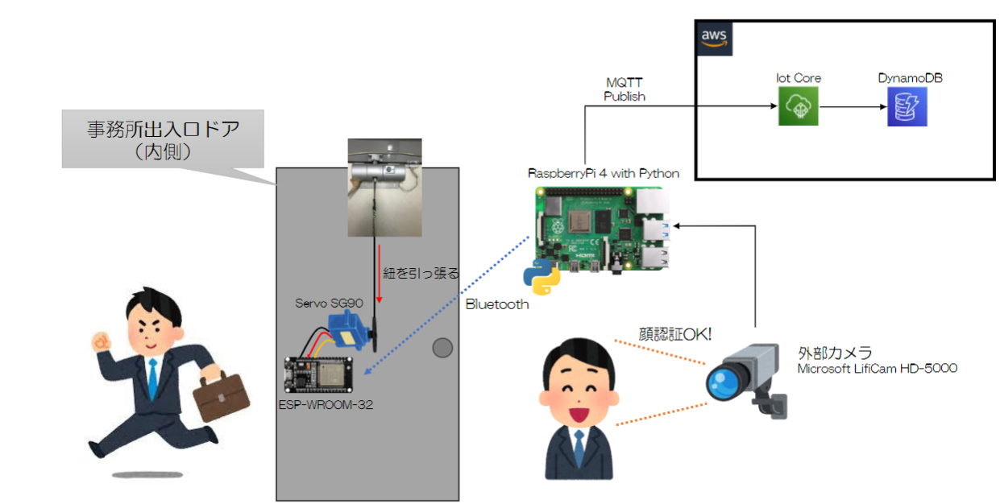
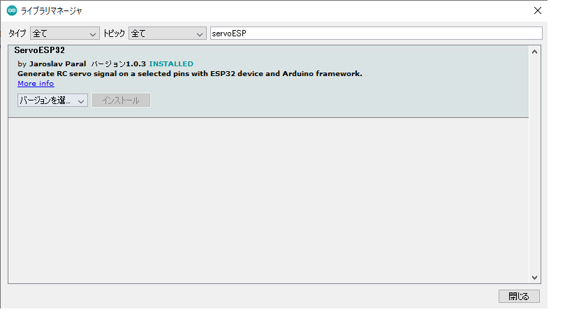
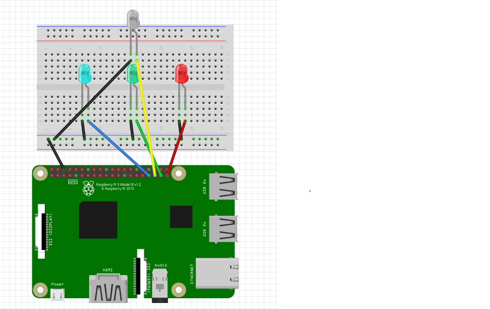

# ESP32にBluetooth接続しServoを動かす  
## 目次  
- [概要説明](#content1)  
- [配線接続](#content2)  
- [ESP32からServoを動かす](#content3)  
- [Raspberry PiにOpencvをインストール](#content4)
- [PythonでBluetooth通信](#content5)  
- [Raspberry Piとカメラを使って顔検出](#content6)  
- [顔認識でServoを動かす](#content7)  
- [残課題](#content8)  

<h2 id="content1">概要説明</h2>  

  

事務所から外へ出るときの紐を自動で引っ張る仕組みを実装する。  
   
ドア付近に設置するカメラが顔を認識。  
↓  
顔を認識したことをRasPiからESP32へ通知。  
↓  
ESP32のプログラムが実行され、紐とつながったモータ(Servo)を動かす。  
また、モータが動いた日時をDynamoDBへ登録  


<h2 id="content2">配線接続</h2>  

- 下図のようにESP32とServoを配線を接続する。  
  ※ここでServoから出ている黄色い線は、ESP32の「D27」につなぐこと。  
  　(「D27」に指定している理由は、この後のソースをそのまま使用するため。)
   

<h2 id="content3">ESP32からServoを動かす</h2>  

- ESP32を動かすためのIDEをインストールする。  
   

- 環境設定の説明 ～一度自分でやってみないとわからない～  
  
  起動したら以下の設定を行う。  

  - ボードマネージャURLの追加  
    ファイル > 環境設定 を開いて  
    以下のURLを「追加のボードマネージャのURL：」の欄にペーストします。  
    URL →　[https://dl.espressif.com/dl/package_esp32_index.json]  
     
       

  - ボードマネージャインストール  
    ツール  > ボード > ボードマネージャ... を開き  
       
    
    検索欄にESPを入力し、「esp32」をインストールする。  
       

  - Servoライブラリの取得  
    ツール > ライブラリを管理... を開き  
    検索欄にservoESPを入力し、「ServoESP32」をインストールする。  
       
  
  -  ボードを選択  
    ツール  > ボード > ESP32 Arduino > ESP32 Dev Module を選択  
       
    
- 動作確認  

  以下のソースをArduinoIDEにコピー。  
  [ServoSample.ino](./ino/ServoSample.ino)  

  ```C#  
  #include <Servo.h>

  Servo myservo; //Servoオブジェクトを作成

  void setup() {
    myservo.attach(27); //27番ピンにサーボ制御線（黄色）を接続
  }

  void loop() {
    myservo.write(180); //180度へ回転 
    delay(1000);
    myservo.write(0); //元に戻る
    delay(1000);
  }
  ```  

  Servoが動いたらOK。

<h2 id="content4">Raspberry PiにOpencvをインストール</h2>  

- Raspberry Piの設定手順はこちらを参考→https://github.com/ksaplabo-org/Raspi-Setup  

- Tera Termを起動して、以下のコマンドを実行する。  
  ```  
  mkdir Opencv
  cd Opencv

  sudo nano OpencvInstall.sh
  ```  

  以下のソースを貼り付ける。  
  [OpencvInstall.sh](./OpencvInstall.sh)    
  
- shファイルの実行はデフォルトで権限がないため、以下のコマンドを実行する。  
  ```  
  sudo chmod 777 OpencvInstall.sh
  ```  
  shファイルを実行  
  ```  
  OpencvInstall.sh
  ```  

- 動作確認  
  以下のコマンドを実行  
  ```  
  python3
  ```  
  
  ```  
  import cv2
  ```

  これでエラーが出なければインストール成功。  

- 動作確認でエラーが出る場合  
  上記のimport cv2を実行すると以下のエラーが出る。  
  <エラー画像挿入>  

  上図のエラー内容は、Opencvを使うためのパッケージが存在しないせいでおこるエラーで
  このようなエラーが出た場合は、以下のサイトを参考にパッケージのインストールを行う。  

  <参考サイト>  
  https://www.shangtian.tokyo/entry/2020/01/02/103124?msclkid=3cbfef7fb3bd11eca1390dff498f0039  
  numpyのパッケージのインストールはこのサイト  
  https://algorithm.joho.info/programming/python/numpy-core-multiarray-failed-to-import/?msclkid=871cc269b3be11ecbea8b1672457fdd1   

<h2 id="content5">PythonでBluetooth通信</h2>  

- pythonでServoを動かす。

  Opencvフォルダ下で以下のファイルを作成する。

  ```  
  sudo nano blcontroll.py
  ``` 

  以下のソースをコピー  
  ※このソースは現在検討中、いったんこれで動く

  ```  
  import bluetooth

  server_addr = 'ESP32のMACアドレス'
  server_port = 1

  sock = bluetooth.BluetoothSocket(bluetooth.RFCOMM)
  sock.connect((server_addr, server_port))

  sock.send('on')
  ```  

  ESP32とPCを接続し、Arduino IDEを開き、以下のソースをコピー  
  [BluetoothSample.ino](./ino/BluetoothSample.ino)  

  以下のコマンドでソースを実行  

  ```  
  python3 blcontroll.py
  ```  

  servoモータが動けばOK。  

<h2 id="content6">Raspberry Piとカメラを使って顔検出</h2>  

- 外部カメラとRaspberry Piを接続する。
- 顔検出のサンプルコードを作成する。  

　Opencvフォルダ下で以下のファイルを作成する。  

  ```  
  sudo nano CameraSample.py
  ```  

  以下のソースをコピー  
  (0.1秒毎に画像から顔を認識し、「顔認識OK」か「顔認識NG」をterminal上に出力するプログラム)  
  [CameraSample.py](./py/CameraSample.py)

- 動作確認  
  以下のコマンドでソースを実行  
  ```
  python3 sample.py  
  ```

  下図のような実行結果になればOK  

    

<h2 id="content7">顔認識でServoを動かす</h2>  

- ESP32とPCを接続し、Arduino IDEを開き、以下のソースをコピー  
　[DoorOpener.ino](./ino/DoorOpener.ino)  

- RaspiとLEDライトの配線は以下のとおり行う。  

  

- Opencvフォルダ下で以下のファイルを作成する。  

  ```  
  sudo nano main.py
  sudo nano alert.py
  sudo nano imager.py
  sudo nano logger.py
  sudo nano opener.py
  ```  

  以下のソースをそれぞれのファイルにコピー  
  [main.py](./py/mian.py)    →　実行クラス  
  [alert.py](./py/mian.py)   →　LEDの操作  
  [imager.py](./py/mian.py)  →　画像解析  
  [logger.py](./py/mian.py)  →　MQLL通信  
  [opener.py](./py/mian.py)  →　モータ操作  

- pythonを実行して動作確認
  
<h2 id="content8">残課題</h2>  

- Bluetooth接続が切れた場合、5秒程のタイムラグがあり、システムが終了する。  
- カメラが切断した後、再接続しても復帰しない  
- マスクをつけた時の反応が悪い  
- Bluetooth通信の暗号化ができていない  
- (検討)顔認証したときのLEDが分かりずらい  
  例えば、LEDを緑色で常時点灯させ、顔認証した時に赤色に変更する。とか。  