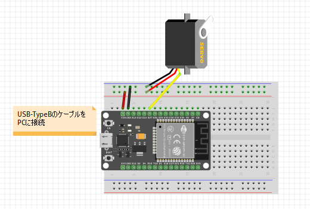
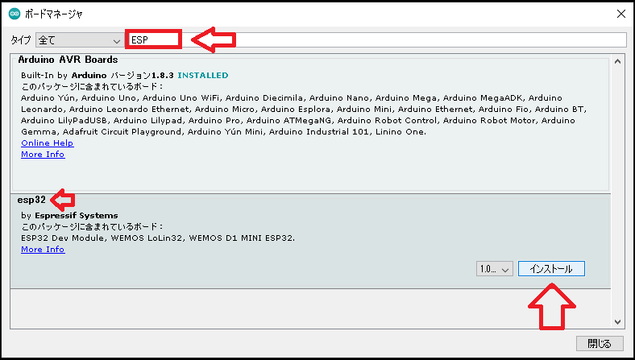
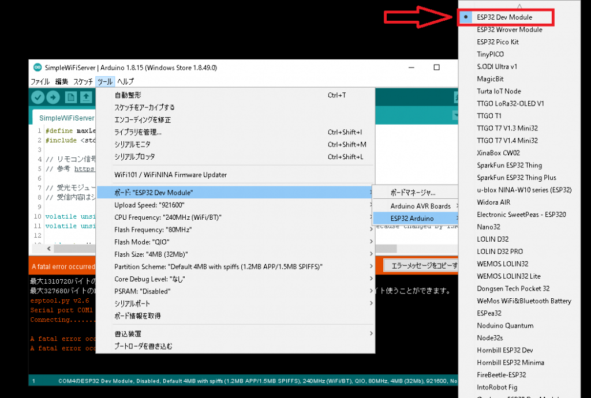

# ESP32にBluetooth接続しServoを動かす  
## 目次  
- [目的説明](#content1)  
- [配線接続](#content2)  
- [ESP32からServoを動かす](#content3)  
- [Raspberry PiにOpencvをインストール](#content4)  

<h2 id="content1">目的説明</h2>  

事務所から外へ出るときの紐を自動で引っ張る仕組みを実装する。  
   
ドア付近に設置するカメラが顔を認識。  
↓  
顔を認識したことをRasPiからESP32へ知らせる。  
↓  
ESP32のプログラムが実行され、紐とつながったモータ(Servo)を動かす  

<h2 id="content2">配線接続</h2>  

### 下図のようにESP32とServoを配線を接続する。  
   

<h2 id="content3">ESP32からServoを動かす</h2>  

### ESP32を動かすためのIDEをインストールする。  
   

### 環境設定の説明 ～一度自分でやってみないとわからない～  
  
  起動したら以下の設定を行う。  

  - ボードマネージャURLの追加  
    URL →　[https://dl.espressif.com/dl/package_esp32_index.json]  
    ファイル > 環境設定  
    を開き、ボードマネージャーを追加します。  
       

  - ボードマネージャインストール  
    ツール  > ボード > ボードマネージャ...  
    を開き  
       
    
    検索欄にESPを入力し、インストールする。  
       
  
  -  ボードを選択  
    ツール  > ボード > ESP32 Arduino > ESP32 Dev Module    
       
    
- 動作確認  

<h2 id="content4">Raspberry PiにOpencvをインストール</h2>  

- 以下のサイトを参考にからOpenCVのダウンロードを行う